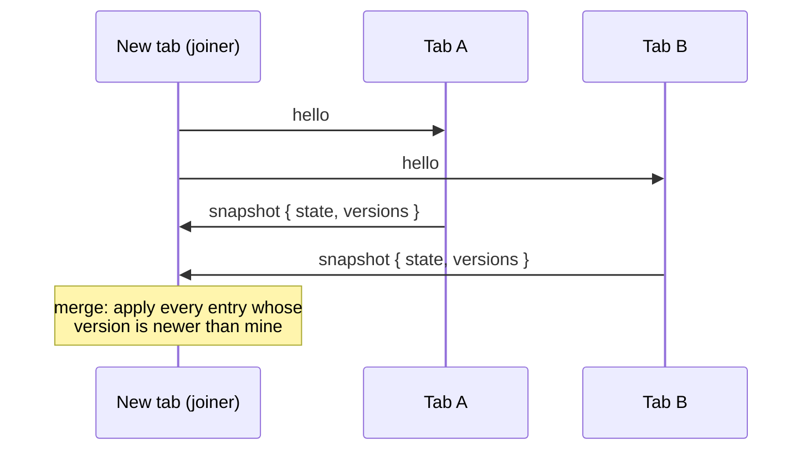
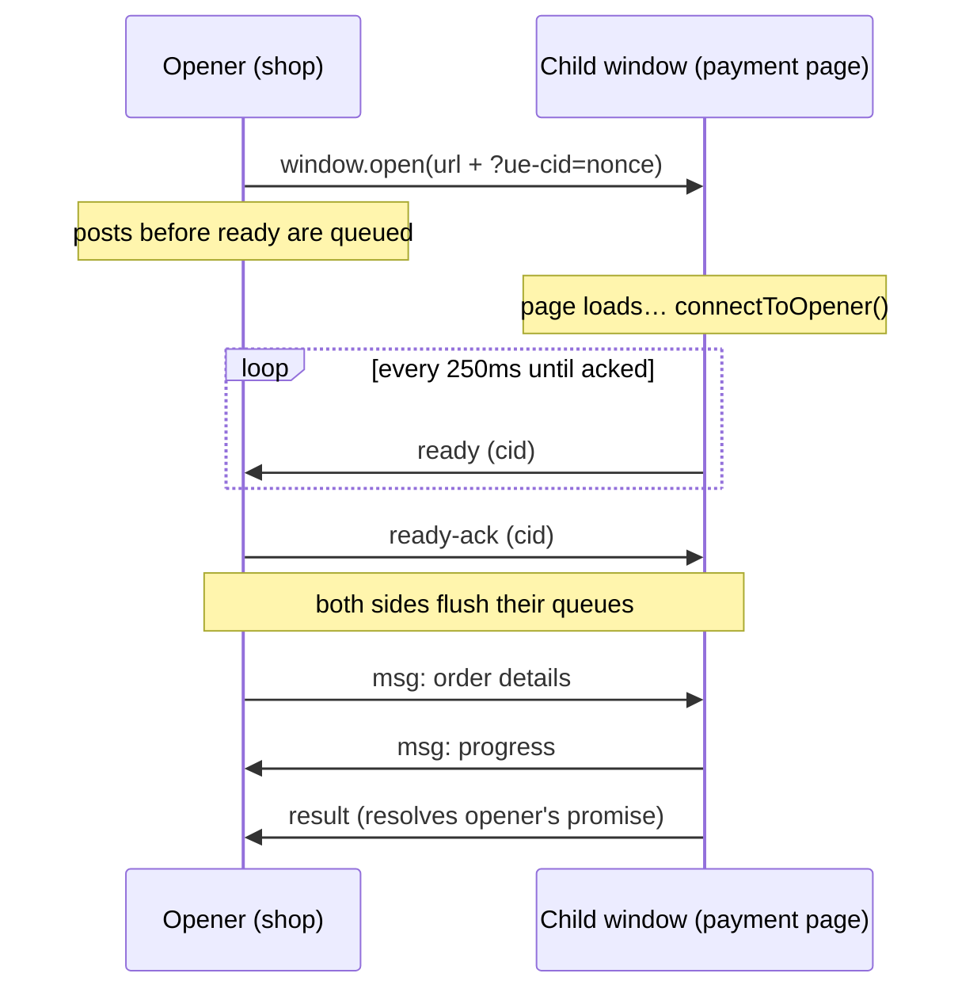

# How sync works

This page walks through the machinery that keeps replicas convergent: version
clocks, the late-joiner handshake, and presence. You do not need any of it to
_use_ the library — read it when you want to reason about edge cases.

## Every key carries a clock

Each key in a shared store has a version: a pair `[counter, clientId]`.
Writing a key increments its counter and stamps the writer's id:

```ts
state.count = 5; // count's version: [1, 'k3j9x2']
state.count = 6; // count's version: [2, 'k3j9x2']
```

The write is broadcast as a **patch** — `{ key, value, version }` — and every
peer applies one rule:

> Apply the patch only if its version is **newer** than mine:
> higher counter wins; equal counters break the tie by comparing client ids.

That rule (`newer()` in the API) is the entire conflict story. It is
last-writer-wins per key, with a deterministic tie-break so every replica
picks the _same_ winner.

## Walkthrough: two tabs write at once

Tab A (`aaaaaa`) and tab B (`bbbbbb`) both hold `note` at version `[3, …]`,
and both write before either patch arrives:

| Moment  | Tab A                                                                | Tab B                                                     |
| ------- | -------------------------------------------------------------------- | --------------------------------------------------------- |
| write   | `note = "from A"` → `[4, aaaaaa]`                                    | `note = "from B"` → `[4, bbbbbb]`                         |
| receive | gets `[4, bbbbbb]` — same counter, `bbbbbb > aaaaaa` → **applies B** | gets `[4, aaaaaa]` — tie, `aaaaaa < bbbbbb` → **keeps B** |
| result  | `"from B"`                                                           | `"from B"`                                                |

Both tabs agree, and a third tab receiving the patches in _either order_ also
lands on `"from B"`. Convergence never depends on delivery order.

:::info What LWW means for you
Tab A's write was _discarded_, not merged. For a counter, a form field, or a
status flag that is exactly right. For collaborative text editing it is not —
that problem needs CRDTs or OT, which is out of scope by design.
:::

## The late-joiner handshake

BroadcastChannel has no history: a message posted before you subscribed is
gone. So how does a freshly opened tab show the current count instead of `0`?



On creation, a store broadcasts `hello`. Every existing peer answers with a
**snapshot** — its full state plus all versions. The joiner merges each entry
through the same `newer()` rule, so receiving three snapshots is harmless:
older entries are simply ignored.

Your initial value participates too, at version `[0, myId]`. Any value a peer
has actually _written_ has a counter ≥ 1 and therefore beats it — which is why
`useSharedState('count', 0)` hydrates to the real count and never stomps it.

:::tip
The same mechanism means the _initial values disagree_ case is resolved
deterministically: two fresh tabs with different initials converge on the one
whose client id sorts higher, at version 0, until someone actually writes.
:::

## Presence: heartbeats with piggybacking

Presence answers "who else is here?" without any central registry:

- On joining a bus, a client broadcasts `hello`; existing peers reply with a
  `ping` so the joiner learns about them immediately.
- Every client pings every **2 seconds**.
- A peer silent for **5 seconds** is pruned (a crashed tab never says goodbye).
- A closing tab broadcasts `bye` on `pagehide`, so clean exits disappear
  instantly instead of timing out.
- **Any** message from a peer — a state patch, an event — counts as a
  liveness signal, so busy tabs never flicker offline.

Peers carry a `kind` (`'tab'` or `'worker'`, extensible), which is how the
demo renders workers as square dots and how `scope: 'tabs'` knows which writes
to ignore.

## The cross-origin handshake

The window channel has a different problem: the child page may take seconds to
load, and `postMessage` to a window that is not listening yet is silently
lost. The solution is a retrying handshake with queueing on both sides:



Nothing you `post()` before the handshake is dropped — it waits in a queue and
flushes on `ready`. If the handshake never completes (default 15s) both
`ready` and `result` reject with `HandshakeTimeoutError`; if the user closes
the window first, `result` rejects with `WindowClosedError` (detected by both
a `pagehide` signal from the child and a 400ms `window.closed` poll, so even a
crashed child is noticed).

## Delivery guarantees, honestly

- **Latency**: BroadcastChannel delivery is typically sub-millisecond to a few
  milliseconds; it is an async task, never synchronous.
- **Ordering**: patches from one writer arrive in order; interleavings between
  writers are resolved by the clock, not by arrival order.
- **No echo**: your own posts are never delivered back to you — a `Channel`
  message handler only ever fires for _other_ clients' events.
- **At-most-once**: there is no ack or retry on the same-origin bus. If a tab
  is mid-refresh when an event fires, it misses it — use state, which
  re-hydrates, for anything that must survive that.
