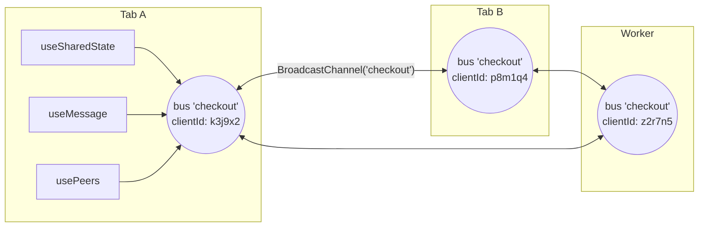
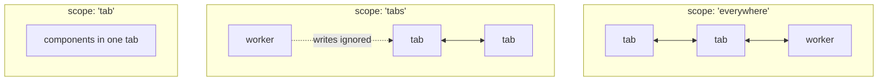

# The mental model

Every abstraction in use-everywhere follows from two ideas. Internalize these
and the whole API becomes predictable.

## Idea 1: a value that exists in more than one place

`useState` gives you a value that exists in one component. Lift it to context
and it exists in one React tree. use-everywhere lifts it one more level: **the
value exists in every tab, window, and worker on your origin at once.**

```tsx
const [count, setCount] = useSharedState('count', 0);
```

There is no "server tab" and no "main copy". Each tab holds its own replica,
every write is broadcast, and the replicas converge. You can _pretend_ it is
one object — the library's job is to keep that pretense honest:

- Writes appear everywhere within a few milliseconds.
- Two tabs writing at the same moment end up agreeing on one winner
  (never a split brain).
- A tab opened _later_ immediately sees the current value, not the initial one.

The corollary: **the value lives exactly as long as some context holds it.**
Close the last tab and the state is gone — nothing is persisted anywhere. This
is a feature (nothing to clean up, nothing stale on disk), but it means
use-everywhere replaces `postMessage` plumbing, not your database. See
[Limitations](../limitations.md).

## Idea 2: two worlds, two trust levels

Browsers draw a hard line at the **origin** (`scheme://host:port`), and the
library embraces it rather than papering over it:

|               | Same origin                                | Cross origin                               |
| ------------- | ------------------------------------------ | ------------------------------------------ |
| Who is there  | Your own tabs, windows, workers            | A page you opened on another domain        |
| Trust         | Full — it is all your code                 | None — it is another security principal    |
| Topology      | Many-to-many bus                           | Strict 1:1, parent ↔ child                 |
| Transport     | `BroadcastChannel`                         | `window.opener` / `postMessage`            |
| API surface   | `useSharedState`, `useMessage`, `usePeers` | `openWindow` / `connectToOpener`           |
| Shape of data | Shared _state_ and broadcast _events_      | Explicit typed _messages_ and one _result_ |

Shared state deliberately never crosses the origin line. A foreign page that
could merge writes into your state tree would be a
[confused deputy](./security-model.md); across origins you exchange explicit,
validated messages instead — request/result shaped, like the payment flow.

## The bus: what a "name" really is

Every same-origin primitive takes a `name`. Behind one name there is exactly
one **bus** per tab: one `BroadcastChannel`, one client identity.



Three things follow:

1. **The name is the identity.** Two components using store `'checkout'` in
   the same tab share one store instance; two _tabs_ using `'checkout'` are
   two peers on the same wire. There is no Provider because a BroadcastChannel
   is already global to the origin — a React context could not scope it any
   further.
2. **One client id per tab per name.** State patches, events, and presence all
   carry the same `clientId`, so "which tab changed this?" and "which dot is
   that tab?" have the same answer.
3. **Everything shares the wire.** State sync, events, and presence heartbeats
   are multiplexed over the one channel, and any message from a peer doubles
   as proof of life for presence.

## The three same-origin views

The bus itself is internal. You consume it through three views, each answering
a different question:

- **Shared state** (`useSharedState`) — _"what is the current value?"_
  Convergent, hydrating, last-writer-wins. Use it for anything you'd render.
- **Messages** (`useMessage` / `useChannel`) — _"what just happened?"_
  Fire-and-forget events with no history; a tab that joins later never sees
  old events. Use it for triggers: `logged-out`, `cart-updated`.
- **Presence** (`usePeers`) — _"who else is here?"_ A live list of peer
  `{ id, kind }`, maintained by heartbeats.

A useful litmus test: if a late-joining tab must know it, it is **state**. If
only currently-open tabs care, it is a **message**.

## Choosing the blast radius

`useSharedState` lets you delimit how far a value travels:



Same key, different scopes = different values. Scope is part of the identity.

## Where to go next

- [How sync works](./how-sync-works.md) — version clocks, convergence, and the
  late-joiner handshake, step by step.
- [Security model](./security-model.md) — what the cross-origin channel
  validates and why.
