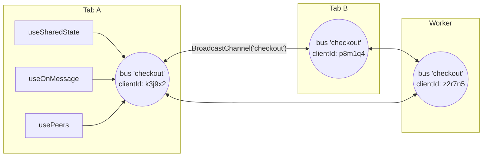
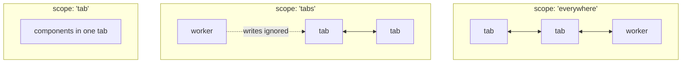

Everything in use-everywhere follows from two ideas. Once they click, the
whole API stops being something you look up and starts being something you
can predict.

## Idea 1: a value that exists in more than one place

`useState` gives you a value that exists in one component. Lift it to context
and it exists in one React tree. use-everywhere lifts it one more level:
**the value exists in every tab, window, and worker on your origin at once.**

```tsx
const [count, setCount] = useSharedState('count', 0);
```

There is no "server tab" and no "main copy". Each tab holds its own replica,
every write is broadcast, and the replicas converge. You get to _pretend_
it's one object — and the library's whole job is keeping that pretense
honest:

- Writes appear everywhere within a few milliseconds.
- Two tabs writing at the same moment end up agreeing on one winner — never
  a split brain.
- A tab opened _later_ immediately sees the current value, not the initial
  one.

The corollary is worth internalizing early: **the value lives exactly as long
as some context holds it.** Close the last tab and the state is gone —
nothing is persisted anywhere. That's a feature (nothing to clean up, nothing
stale on disk), but it means use-everywhere replaces `postMessage` plumbing,
not your database. See
[what it deliberately doesn't do](../under-the-hood/limitations.md).

## Idea 2: two worlds, two trust levels

Browsers draw a hard line at the **origin** (`scheme://host:port`), and the
library embraces that line rather than papering over it. Everything you do
lives in one of two worlds:

|               | Same origin                                  | Cross origin                               |
| ------------- | -------------------------------------------- | ------------------------------------------ |
| Who is there  | Your own tabs, windows, workers              | A page you opened on another domain        |
| Trust         | Full — it is all your code                   | None — it is another security principal    |
| Topology      | Many-to-many bus                             | Strict 1:1, parent ↔ child                 |
| Transport     | `BroadcastChannel`                           | `window.opener` / `postMessage`            |
| API surface   | `useSharedState`, `useOnMessage`, `usePeers` | `openWindow` / `connectToOpener`           |
| Shape of data | Shared _state_ and broadcast _events_        | Explicit typed _messages_ and one _result_ |

Shared state deliberately never crosses the origin line. A foreign page that
could merge writes into your state tree would be a
[confused deputy](../under-the-hood/security-model.md); across origins you
exchange explicit, validated messages instead — request/result shaped, like
the payment flow. The design in one line: **across trust boundaries,
explicit beats magic.**

## What a "name" really is

Every same-origin primitive takes a `name`. Behind one name there is exactly
one **bus** per tab: one `BroadcastChannel`, one client identity, one
heartbeat.



Three things follow, and each one answers a common question:

1. **The name is the identity.** Two components using store `'checkout'` in
   the same tab share one store instance; two _tabs_ using `'checkout'` are
   two peers on the same wire. This is also why there's no Provider: a
   BroadcastChannel is already global to the origin, so a React context
   couldn't scope it any further — wrapping it would be ceremony without
   meaning.
2. **One client id per tab per name.** State patches, events, and presence
   all carry the same `clientId`, so "which tab changed this?" and "which
   presence dot is that tab?" have the same answer.
3. **Everything shares the wire.** State sync, events, and presence
   heartbeats are multiplexed over the one channel, and any message from a
   peer doubles as proof of life — so chatty tabs never pay extra heartbeat
   cost.

## The three same-origin views

The bus itself is internal. You consume it through three views, each
answering a different question:

- **Shared state** ([`useSharedState`](../hooks/use-shared-state.md)) —
  _"what is the current value?"_ Convergent, hydrating, last-writer-wins.
  Use it for anything you'd render.
- **Messages** ([`useOnMessage`](../hooks/use-on-message.md) /
  [`useChannel`](../hooks/use-channel.md)) — _"what just happened?"_
  Fire-and-forget events with no history; a tab that joins later never sees
  old events. Use it for triggers: `logged-out`, `cart-updated`.
- **Presence** ([`usePeers`](../hooks/use-peers.md)) — _"who else is here?"_
  A live list of peer `{ id, kind }`, maintained by heartbeats.

:::tip[The litmus test]
If a late-joining tab must know it, it is **state**. If only currently-open
tabs care, it is a **message**.
:::

## Choosing the blast radius

`useSharedState` lets you delimit how far a value travels:



Same key, different scopes = different values. **Scope is part of the
identity**, on purpose — a `tab`-scoped `'draft'` and an `everywhere`-scoped
`'draft'` never bleed into each other.

## Where to next

- [Hooks overview](../hooks/overview.md) — the API this model maps onto,
  hook by hook.
- [How sync works](../under-the-hood/how-sync-works.md) — version clocks,
  convergence, and the late-joiner handshake, step by step.
- [Security model](../under-the-hood/security-model.md) — what the
  cross-origin channel validates and why.
